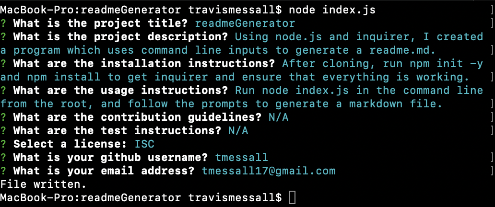
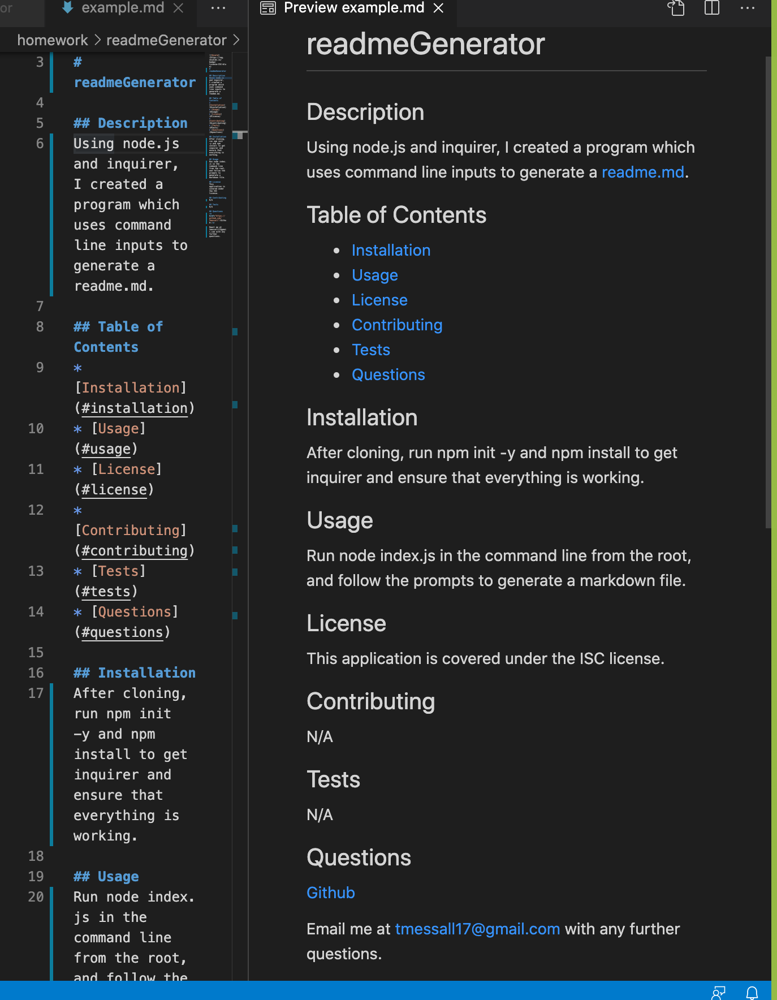

# readmeGenerator

## Description
Using node.js and inquirer, I created a program which uses command line inputs to generate a readme.md.

## Table of Contents
* [Installation](#installation)
* [Usage](#usage)
* [Questions](#questions)

## Installation
After cloning, run npm init -y and npm install to get inquirer and ensure that everything is working.

## Usage
Run node index.js in the command line from the root, and follow the prompts to generate a markdown file.

## Questions
<a href="https://github.com/tmessall">Github</a>

Email me at tmessall17@gmail.com with any further questions.
